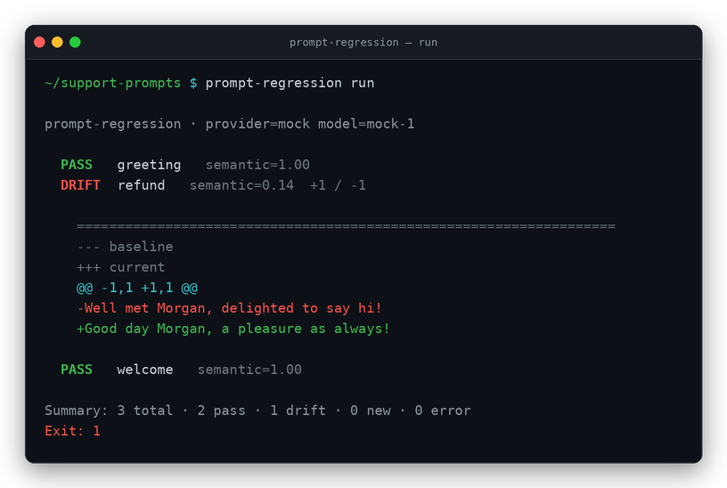

# prompt-regression

> Snapshot testing for LLM prompts — catch prompt & model regressions before you ship.

`prompt-regression` runs a set of prompt **cases** against a model, stores the outputs as approved
**baselines**, and on every run **diffs new outputs against the baseline** — textual *and* semantic —
with a CI-friendly exit code and an `approve` workflow to bless new output. Think `jest -u`, but for
prompts.

## Screenshot

<!-- TODO: replace with a GIF/PNG of a DRIFT run showing the colored unified diff -->


## Why

When you change a prompt, swap a model, or bump a model version, outputs shift *silently* — a format
regresses, a refusal appears, a JSON field vanishes — and you usually find out in production.
`prompt-regression` freezes a known-good output and **fails loudly when it drifts**, until a human
approves the new baseline. It runs with **zero API keys** out of the box (a deterministic `mock`
provider), so you can try the whole workflow in under a minute.

## Install

```bash
npm i -g prompt-regression
# or run without installing:
npx prompt-regression --help
```

## Quickstart (no API key required)

```bash
npx prompt-regression init            # scaffold config + a sample case (mock provider)
npx prompt-regression run             # first run: creates baselines → all NEW
npx prompt-regression run             # unchanged: all PASS

# edit cases/hello.case.yaml, change the prompt, then:
npx prompt-regression run             # shows a DRIFT diff, exits 1

npx prompt-regression approve --yes   # bless the new output as the baseline
npx prompt-regression run --ci        # green build, exit 0
```

## Example

```
$ npx prompt-regression run

prompt-regression · provider=mock model=mock-1

  DRIFT  hello   Friendly greeting   semantic=0.71 (min 0.92)  +1 / -1

    --- baseline
    +++ current
    @@ -1 +1 @@
    -Hello Ada, lovely to meet you!
    +Good day, Ada — wishing you a wonderful one!

Summary: 1 total · 0 pass · 1 drift · 0 new · 0 error
Exit: 1
```

## Using real models

```bash
export ANTHROPIC_API_KEY=sk-...
npx prompt-regression run --provider anthropic --model claude-3-5-haiku-latest

export OPENAI_API_KEY=sk-...
npx prompt-regression run --provider openai --model gpt-4o-mini
```

## CI

```yaml
# .github/workflows/prompt-regression.yml (excerpt)
- run: npx prompt-regression run --ci
  env:
    ANTHROPIC_API_KEY: ${{ secrets.ANTHROPIC_API_KEY }}
```
Exit `0` = all PASS/NEW · `1` = at least one DRIFT/ERROR · `2` = usage/config error.

## Configuration

See [`DESIGN.md`](./DESIGN.md) for the full config, data models, and design rationale. Baselines live
under `.prompt-regression/baselines/` and are meant to be **committed** so drift shows up in code
review.

## License

MIT © 2026 Keith Lindsay

## Companion blog post

Pairs with **"How to Ship an AI Feature in a Quarter"** — this tool is the regression gate from that
post. <!-- TODO: add published URL -->
